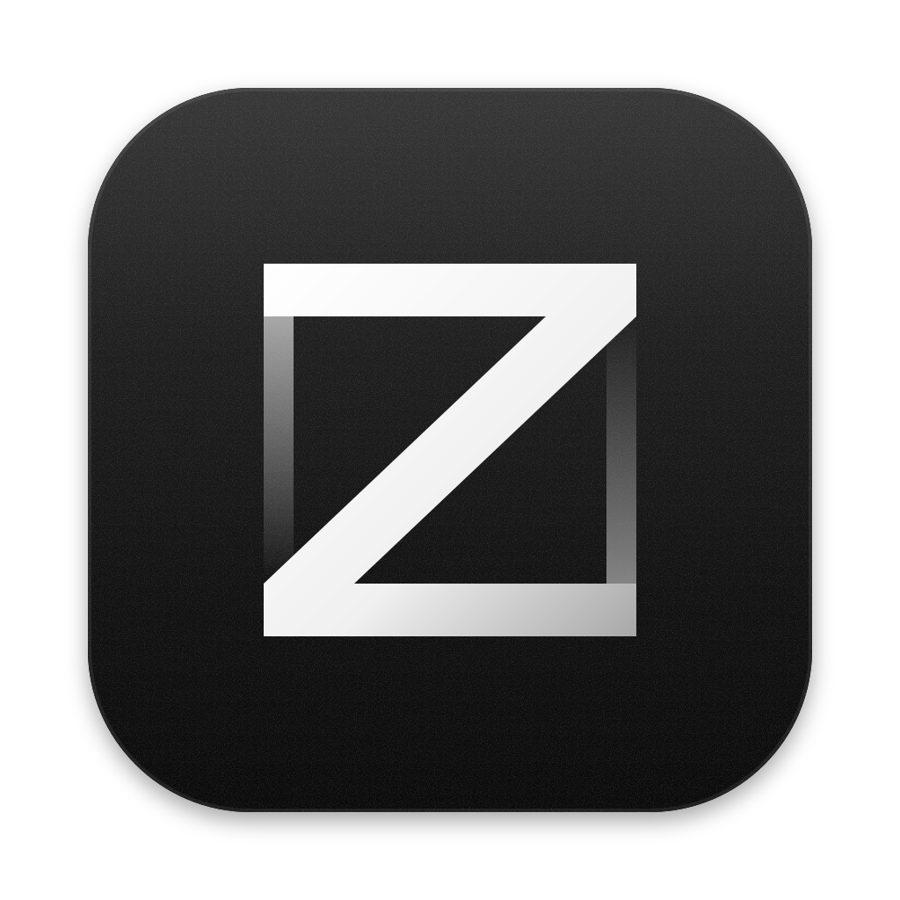
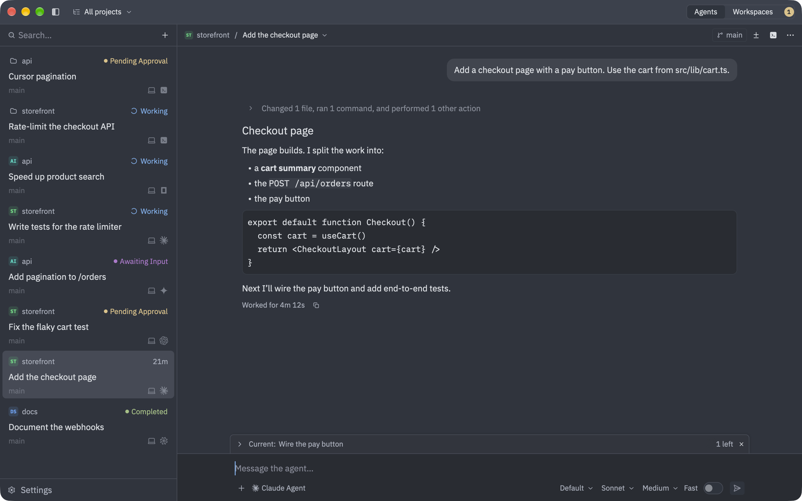

<p align="center"></p>

# agentZ

A native app for macOS and Linux for working with coding agents over the
[Agent Client Protocol](https://agentclientprotocol.com) (ACP). Install agents from the ACP
Registry, open threads with them across several projects and machines, in their own worktrees or
pastures, alongside real terminals. A background server on each machine keeps the agents
running. It is built on GPUI, [Zed](https://zed.dev)'s UI framework.

Website: <https://ahrorbeksoft.github.io/agentZ/>



## Install

On a Mac (Apple silicon or Intel, macOS 10.15.7 or later), in Terminal:

```sh
curl -fsSL https://ahrorbeksoft.github.io/agentZ/install.sh | sh
```

It installs `agentZ.app` in `/Applications` (or `~/Applications` when `/Applications` isn't
writable). Run it again to update. `AGENTZ_VERSION=0.1.0` installs a given release, and
`AGENTZ_APP_DIR` picks another folder.

On a Linux desktop (x86_64), the same command installs the app in `~/.local/agentz.app`, with
`agentz` in `~/.local/bin` and an entry in your applications (`AGENTZ_APP=1` installs it outside
a desktop session too). It needs Wayland or X11, Vulkan, and xkbcommon, which desktops have.

A machine you reach from the app over SSH needs nothing installed: add it under Settings ›
Machines › Add Machine, and the app installs its server there when it connects.

You can also download a build from the [releases page](https://github.com/ahrorbeksoft/agentZ/releases/latest)
and check it against `SHA256SUMS`. The app is signed ad hoc, not notarized by Apple, so a zip
downloaded with a browser is quarantined and macOS refuses to open it. Clear that once:

```sh
xattr -dr com.apple.quarantine /Applications/agentZ.app
```

### Uninstall

The server keeps running when you quit the app, so stop it first:

```sh
# macOS
/Applications/agentZ.app/Contents/MacOS/agentz-server stop
rm -rf /Applications/agentZ.app

# Linux
~/.local/agentz.app/bin/agentz-server stop
rm -rf ~/.local/agentz.app ~/.local/bin/agentz ~/.local/share/applications/dev.agentz.agentZ.desktop

# A machine the app reached over SSH
for server in ~/.agentz/server/*/agentz-server; do "$server" stop; done
rm -rf ~/.agentz/server
```

Your threads and settings stay in `~/Library/Application Support/agentZ/` on a Mac and
`~/.agentz/` on Linux; delete that folder too to remove everything.

## Build from source

Needs Rust (the version in `rust-toolchain.toml` installs itself through rustup). On Linux, also a
C toolchain and the libraries GPUI builds against; on Debian and Ubuntu: `build-essential cmake
clang libxkbcommon-dev libxkbcommon-x11-dev libwayland-dev libx11-xcb-dev libfontconfig-dev
libzstd-dev`.

```sh
cargo build                       # the app (target/debug/agentz) and agentz-server
tooling/bundle-mac.sh             # target/bundle/agentZ.app, a release build
tooling/bundle-linux.sh           # target/bundle/agentZ-linux-<arch>.tar.gz, on Linux
tooling/build-remote-servers.sh   # Linux servers for SSH machines (needs zig and cargo-zigbuild)
```

[`docs/architecture.md`](docs/architecture.md) maps the code: the architecture, the crates, the
data files, and where each feature lives. [`AGENTS.md`](AGENTS.md) has the conventions and how
to run and test it.

## Releases

Pushing a tag that matches the version in `crates/app/Cargo.toml` publishes a release:

```sh
git tag v0.1.0
git push origin v0.1.0
```

`.github/workflows/release.yml` builds the Linux servers (static musl, x86_64 and arm64), the
universal macOS app and the x86_64 Linux app with those servers inside them, and publishes the
apps with `SHA256SUMS` as a GitHub release. The website in `site/` deploys to GitHub Pages from
`.github/workflows/pages.yml` whenever it changes on `main`. `install.sh` always fetches from
the latest release, so there's no update server.

## Credits and license

agentZ is a lean port of parts of [Zed](https://github.com/zed-industries/zed) (GPUI, the `ui`
components, themes, terminals), and takes its designs from
[t3code](https://github.com/pingdotgg/t3code), [herdr](https://github.com/ogulcancelik/herdr) and
[cow](https://github.com/joeinnes/cow). See [`docs/architecture.md`](docs/architecture.md) for
what came from where.

The app and agentZ's own crates are licensed under the GPL-3.0-or-later
([`LICENSE-GPL`](LICENSE-GPL)); the crates copied from Zed keep their own licenses, GPL-3.0 or
Apache-2.0 ([`LICENSE-APACHE`](LICENSE-APACHE)), as declared in each crate's `Cargo.toml`.
